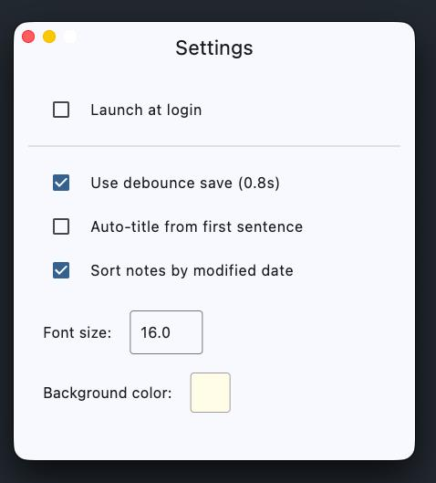

# Quick Notes

A lightweight, portable, and fast note-taking application built with Flutter for macOS. Designed to live in your system tray for instant access.




## Features

- **Tray-based UI**: Access your notes instantly from the macOS menu bar.
- **Portable Data**: All notes and settings are stored in a `QuickNotesData` folder next to the executable.
- **Auto-save**: Never lose a thought with automatic debounced saving.
- **Customizable**: Change font size and background color to suit your style.
- **Grid Background**: Classic notebook-style grid for a better writing experience.
- **Multi-window Settings**: Separate, non-resizable settings window.
- **Smart Titles**: Automatically generates titles from the first sentence or uses custom ones.
- **Launch at Login**: Option to start the app automatically when you log in.

## Installation

1. Download the latest release.
2. Move `QuickNotes.app` to your `Applications` folder.
3. Run the app. It will appear in your menu bar.

## Development

### Prerequisites

- Flutter SDK (3.10.4 or higher)
- Xcode (for macOS builds)

### Running the project

```bash
flutter pub get
flutter run -d macos
```

### Building for release

```bash
flutter build macos
```

## License

This project is licensed under the MIT License - see the [LICENSE](LICENSE) file for details.
